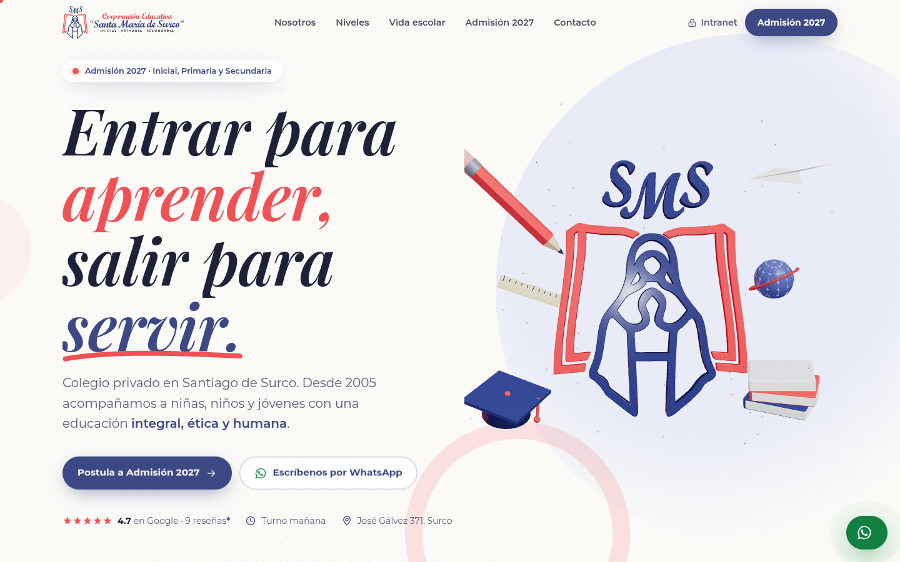
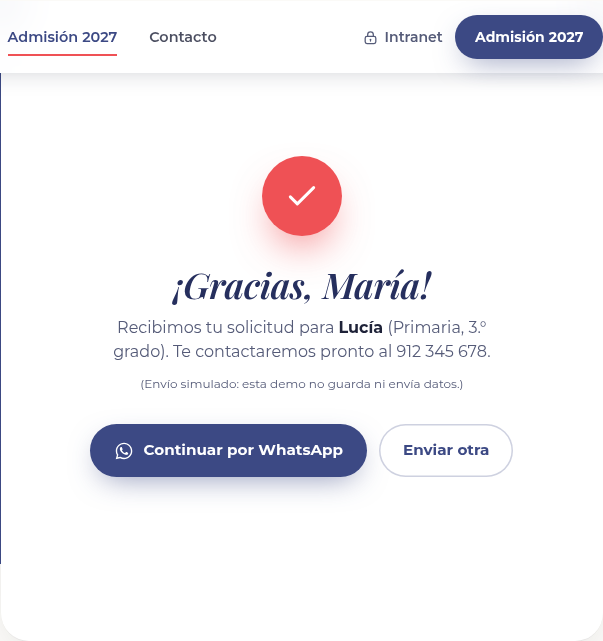
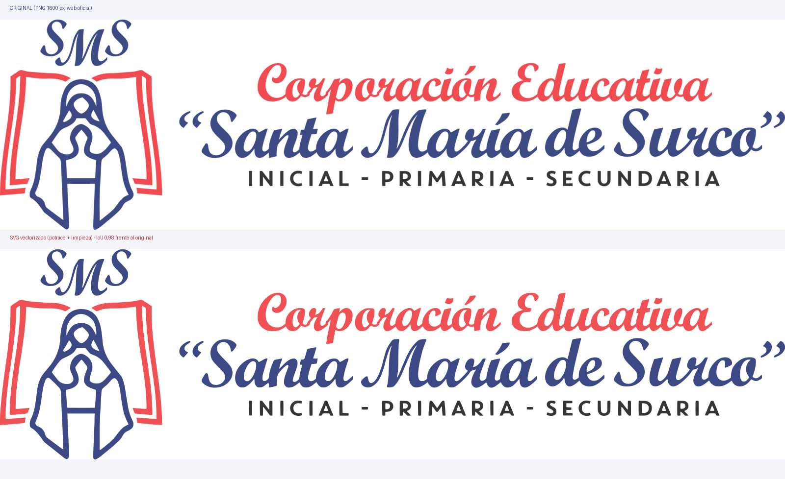

# Demo de rediseño web — I.E.P. Santa María de Surco

> ⚠️ **Demo conceptual no oficial.** Propuesta comercial de rediseño preparada por INKRAAD para presentar al colegio. No está afiliada ni aprobada por la institución. Los datos marcados como **“de ejemplo”** son ilustrativos y deben confirmarse con el colegio antes de publicar.



| Móvil | Admisión 2027 (formulario) |
|---|---|
|  |  |

## La marca
- **Quién es:** I.E.P. Santa María de Surco (Corporación Educativa “Santa María de Surco” E.I.R.L., RUC 20511265305), colegio privado de **Inicial, Primaria y Secundaria** en **José Gálvez 371, Santiago de Surco, Lima**. Inicio de actividades: 12-ago-2005 (SUNAT). Lema: **“Entrar para aprender y salir para servir”**.
- **Presencia actual:** web WordPress a medio hacer (santamariadesurco.com) que todavía dice **“Admisión 2025”**, pide **carné de vacunación COVID-19**, conserva restos de plantilla (`support@test.com`, `+(15) 123-456-7890`, teléfono con prefijo mal escrito) y fotos de stock. La ficha de Google enlaza a un dominio `.edu.pe` que no existe. Facebook activo (~3.4 mil seguidores) e intranet CUBICOL.
- **Qué corrige la demo:** Admisión **2027** actualizada sin requisitos COVID, cero textos de plantilla, teléfono bien escrito (+51 994 703 768) con WhatsApp directo, fotos reales del colegio, y datos estructurados schema.org correctos.

## Qué se construyó
**Concepto:** *“El libro que se abre”*. El emblema oficial —la Virgen orante sobre un libro abierto— se convierte en el hilo conductor: en el hero el emblema está **extruido en 3D** a partir del logo vectorizado y el libro coral “se abre” al cargar, rodeado de útiles escolares flotantes; a lo largo del sitio las transiciones son “páginas” en **índigo y coral** que pasan como hojas, y la historia avanza por etapas (Inicial → Primaria → Secundaria) como capítulos.

### Secciones
1. **Loader de marca** (emblema + lema; cortinas coral e índigo).
2. **Hero** con titular animado palabra por palabra, emblema 3D (R3F) y CTA a Admisión 2027 y WhatsApp.
3. **Cinta doble** cruzada azul/coral (marquee).
4. **Nosotros**: manifiesto que se “ilumina” con el scroll, foto real con máscara de arco, pilares Aprender / Servir / Acompañar y cita de reseña real.
5. **Cifras animadas** (solo datos reales, ver abajo).
6. **Niveles (scroll storytelling)**: sección fijada (pin) con tres capítulos; cada cambio entra con una “hoja” coral o índigo y cambia el color de fondo. En móvil y con movimiento reducido se muestran apilados.
7. **Talleres y servicios** (cómputo, psicología, seguro Rimac, taekwondo, danza + acceso a la intranet CUBICOL) con tarjetas con inclinación 3D y brillo que sigue al cursor.
8. **Vida escolar**: carrusel de actividades anuales + **galería con profundidad** (perspectiva CSS 3D, capas en distintos `translateZ`, parallax por capa y giro con el mouse; fotos reales en hexágonos, como los collages del colegio).
9. **Reseñas de Google** con calificación y nota de transparencia.
10. **Admisión 2027**: pasos, requisitos, horario/pensiones y **formulario solo de front** con validación accesible (mensajes por campo, foco al primer error, celular peruano de 9 dígitos) y **estado de enviado simulado** que ofrece continuar por WhatsApp con el mensaje prellenado.
11. **Contacto / ubicación** con mapa de Google (carga diferida) y datos reales.
12. **Footer** con logo blanco, lema, redes, intranet y aviso de demo.
- Botón flotante de WhatsApp, cursor personalizado (solo puntero fino), botones magnéticos, smooth scroll con Lenis.

### Efectos implementados
- React Three Fiber: emblema oficial **extruido desde el SVG** (`SVGLoader` + `ExtrudeGeometry`, materiales con clearcoat), animación de apertura del libro, seguimiento del puntero, rotación con el scroll; útiles escolares con `Float` y partículas `Sparkles` en colores de marca. El render se pausa cuando el hero sale de pantalla.
- **Fallback sin WebGL** (móvil, `prefers-reduced-motion`, “ahorro de datos”, < 4 núcleos o error de WebGL): emblema SVG + útiles en SVG con animación CSS. El chunk de Three.js **no se descarga** en esos casos. Parámetros de prueba: `?no3d`, `?force3d`, `?noloader`.
- GSAP + ScrollTrigger: pin y timeline con scrub en Niveles, wipes coral/índigo, reveal por lotes, texto que se ilumina por palabra, máscara de arco, contadores, parallax en hero y galería.
- Motion: menú móvil con revelado circular, transición del formulario al estado enviado.
- Lenis: smooth scroll sincronizado con el ticker de GSAP (desactivado con movimiento reducido).

### Accesibilidad, SEO y rendimiento
- `lang="es-PE"`, enlace “Saltar al contenido”, foco visible, navegación por teclado, `aria-current` en el menú, menú móvil con Escape, etiquetas y errores asociados (`aria-invalid`, `aria-describedby`), textos alternativos descriptivos.
- Contraste AA: el coral de marca se usa en textos grandes/decoración; para texto pequeño se usa un coral oscurecido (`#C2353A`). Botón de WhatsApp en verde oscuro (5:1).
- `prefers-reduced-motion`: sin loader, sin smooth scroll, sin 3D, sin pin; contenido estático.
- SEO: título y descripción, Open Graph + Twitter Card (`public/og-image.png`), favicon del emblema y **JSON-LD `EducationalOrganization`/`School`** solo con datos reales (sin `aggregateRating`, porque la cifra no está verificada en vivo). `robots: noindex` porque es una demo.
- Imágenes WebP optimizadas, `loading="lazy"`, `srcset`; fuentes servidas localmente; Three.js en un chunk aparte cargado bajo demanda.

## Identidad
- Logo oficial vectorizado a SVG (potrace por capas de color + limpieza), comparado con el original: **IoU ≈ 0,98** (horizontal) y 0,98 (emblema). Ver `docs/logo-comparacion.png` y `docs/logo/`.
- Paleta exacta: **#3C4984** (índigo), **#EF5155** (coral), **#FFFFFF**; derivados documentados en `docs/manual-de-marca.md`.
- Tipografías: Playfair Display Italic (eco de la serif itálica del logo) + Montserrat.



## Datos: reales vs. de ejemplo
**Reales (fuente: investigación de marca del 06-oct-2026, `brand.md`):** nombre, razón social y RUC, dirección (José Gálvez 371, Santiago de Surco 15049), coordenadas, teléfono/WhatsApp +51 994 703 768, correo iepsantamariadesurco.edu@gmail.com, Facebook, intranet CUBICOL, lema, niveles, turno mañana (MINEDU), servicios (cómputo, psicología, seguro Rimac, taekwondo, danza), actividades anuales, año de inicio 2005 (SUNAT), 3 reseñas citadas textualmente y fotos reales.

**Cifras de los contadores:** 21 años (desde 12-ago-2005, SUNAT), 3 niveles, 5 talleres/servicios (los listados en su web) y 4.7★ en Google.

**Con aviso / pendiente de verificar:**
- **4.7★ con 9 reseñas**: tomadas de un espejo de datos de Google Maps (Exa Places) el 06/10/2026, **sin verificar en vivo**. El sitio lo indica con un asterisco y una nota en la sección de reseñas. Los autores de las reseñas no estaban disponibles en la fuente, por eso no se muestran nombres. Una de las tres reseñas es de un proveedor (se mantiene por ser real).

**Contenido de ejemplo (marcado en la web con la etiqueta “de ejemplo” y en el código con `CONTENIDO DE EJEMPLO`):**
- Pasos del proceso de admisión (referenciales).
- Lista de requisitos de admisión (salvo “diagnóstico neuropediátrico, en caso aplique”, que sí figura en su web).
- Textos descriptivos de cada nivel y de los servicios (copy propuesto para la demo).
- **Horarios y pensiones: no se inventaron.** Se muestra “Turno mañana” (dato real) y “horario detallado por confirmar” / “pensiones se informan de forma personalizada”.
- Calendario 2027 de actividades: sin fechas (“por confirmar con el colegio”).
- El formulario **no envía datos** (envío simulado).

## Tecnologías
Vite 8 · React 19 · TypeScript · Tailwind CSS v4 · Three.js · @react-three/fiber · @react-three/drei · GSAP (ScrollTrigger) · Lenis · Motion · @fontsource (Playfair Display, Montserrat) · Playwright (capturas y QA).

## Cómo correrlo
```bash
npm install
npm run dev          # desarrollo en http://localhost:5173
npm run build        # build estático en dist/
npm run preview -- --host 127.0.0.1 --port 47391

# Capturas y QA (con el preview levantado en 127.0.0.1:47391; usa Google Chrome instalado)
npm run screenshots  # escritorio, móvil y página completa en screenshots/
npm run qa           # valida formulario, envío simulado y menú móvil
npm run og           # regenera public/og-image.png
```
Para usar el Chromium de Playwright en vez de Chrome: `npx playwright install chromium` y `PW_CHANNEL=chromium npm run screenshots`.

## Capturas
- Escritorio: `screenshots/desktop.png` (hero), `screenshots/desktop-*.png` (secciones), `screenshots/desktop-full.png` (página completa, modo movimiento reducido).
- Móvil (390×844 @2x): `screenshots/mobile.png`, `screenshots/mobile-*.png`, `screenshots/mobile-full.png`, `screenshots/mobile-menu.png`.
- Formulario: `screenshots/desktop-form-errores.png`, `screenshots/desktop-form-enviado.png`.

## Créditos de imágenes
- Todas las fotos son **del propio colegio** (web oficial y Facebook): aula de Inicial (`IMG_7750.jpg`), afiche de Semana Santa 2024 y recortes del collage de actividades (desfile, feria, visita institucional, abejita, danza). Logo oficial del colegio. No se usaron bancos de imágenes. Las fotos de los banners de servicios de la web actual (aparentemente de stock) **no** se usaron.
- Ilustraciones 3D y SVG de útiles escolares: propias.
- Mapa: Google Maps (embed).

## Limitaciones conocidas
- Las fotos del collage original son de baja resolución (~176 px por hexágono); se reescalaron y se muestran en tamaño moderado. Para la versión final conviene pedir originales al colegio.
- El 3D se probó con WebGL por software (SwiftShader) en Chrome headless; en móviles se usa el fallback SVG a propósito.
- Advertencia en consola de Three r186 (`THREE.Clock` deprecado) proveniente de @react-three/fiber; no afecta el funcionamiento.
- El formulario es solo de front; para producción habría que conectarlo (correo, Google Sheets, CRM o el sistema del colegio).
- Pendiente: verificar en vivo la calificación de Google y corregir en la ficha de Google el enlace al dominio `.edu.pe` inexistente.
